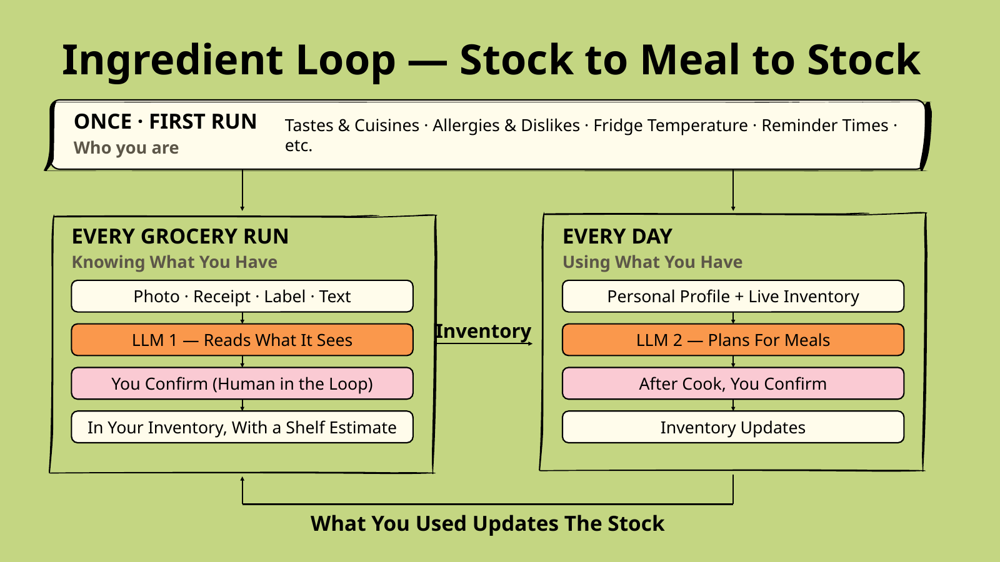
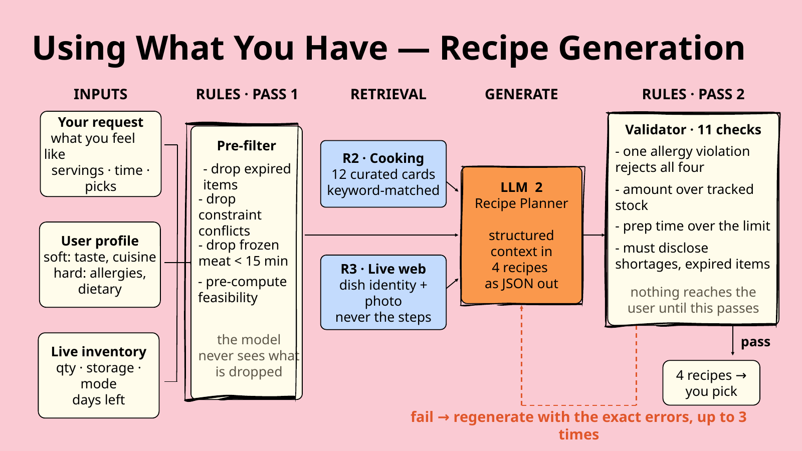
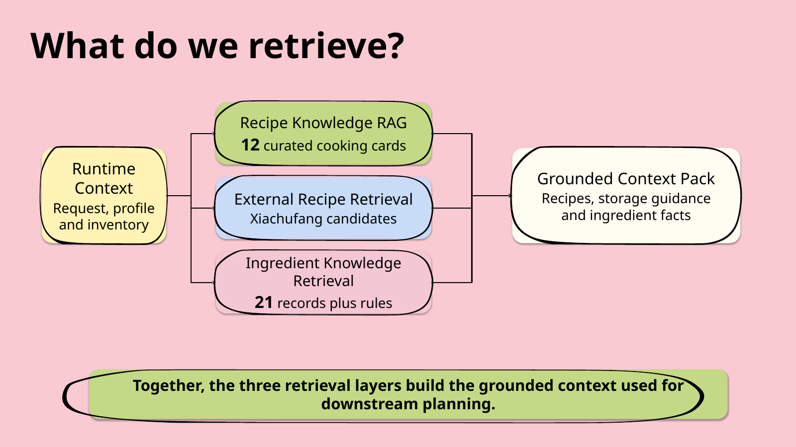
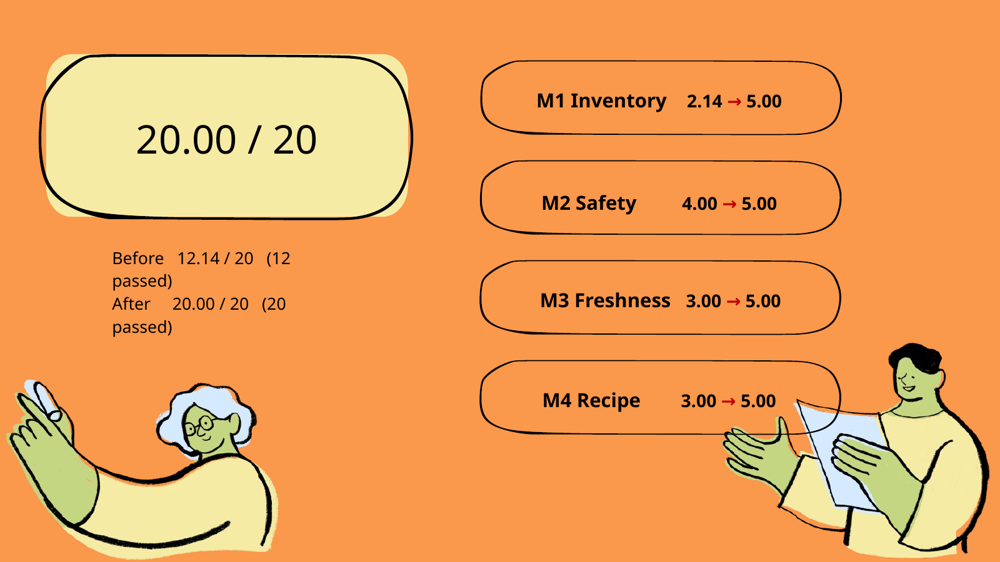

# FreshLoop – AI Food Inventory & Meal Planning

> An AI product that turns imperfect food-inventory information into safe, grounded, and freshness-aware meal recommendations.

[**Try the Live Demo →**](https://fresh-loop-liard.vercel.app)

---

## Overview

FreshLoop is an AI-powered food inventory and meal-planning web app designed for people who cook regularly but struggle to keep track of:

- what ingredients they currently have,
- how much stock remains,
- which ingredients should be used soon,
- and what they can realistically cook with them.

The core product question was:

> How can a GenAI-based system transform imperfect food-inventory information into safe, inventory-grounded, and freshness-aware meal recommendations while reducing food waste and repeated planning effort?

Our intended product workflow is:

**Capture → Understand → Prioritize → Plan → Validate → Update**

---

## Product Flow



FreshLoop is designed as a continuous **Stock → Meal → Stock** loop.

### First Run
The user sets up:

- tastes and cuisines,
- allergies and dislikes,
- fridge conditions,
- reminder preferences,
- and other personal context.

### Every Grocery Run
Users can provide inventory through:

- food photos,
- receipts,
- package labels,
- or typed text.

An AI module proposes structured inventory candidates, but **nothing is saved until the user confirms it**.

### Every Day
FreshLoop combines:

- confirmed inventory,
- freshness information,
- user profile,
- and meal intent

to generate meal options.

After the user cooks and confirms what was used, the inventory is updated again.

This creates a closed product loop rather than a one-time recipe-generation experience.

---

## User Problem

Food inventory data is rarely clean.

Users may provide:

- incomplete quantities,
- unclear expiry dates,
- ambiguous food images,
- missing storage information,
- conflicting dietary preferences,
- or unrealistic preparation-time expectations.

A useful AI meal-planning product therefore cannot simply ask an LLM to:

> "Generate a recipe."

The system needs to decide:

1. what information can be trusted,
2. what remains uncertain,
3. which ingredients should be prioritized,
4. which constraints must never be violated,
5. and whether a generated recommendation is actually feasible.

---

## Product Success Criteria

I translated the product problem into four measurable success criteria.

### M1 — Inventory Grounding

Recommendations should be grounded in actual inventory.

The system should flag uncertainty and shortages instead of inventing missing quantities, dates, or storage information.

### M2 — Safety & Hard Constraints

Allergies, dietary restrictions, and explicit dislikes must be respected.

Hard constraints override freshness or convenience.

### M3 — Freshness-Aware Waste Reduction

The system should prioritize **Use Soon** ingredients where practical and avoid treating expired or past-recorded-date ingredients as normal usable inventory.

### M4 — Recipe Quality & Context

Recommendations should reflect:

- serving size,
- preparation time,
- user preferences,
- current inventory,
- shortages,
- and relevant freshness reasoning.

These four criteria later became the shared evaluation framework for the A/B/C product variants.

---

## Team Scope

As a team, we designed and iterated an end-to-end AI product covering:

- food inventory capture,
- ingredient understanding,
- Human Review,
- freshness and stock management,
- priority ranking,
- meal planning,
- retrieval-grounded generation,
- deterministic constraint validation,
- regeneration on failure,
- and inventory updates after cooking.

The system uses two AI modules with different responsibilities and different levels of authority.

---

## Two AI Modules, Two Different Authorities

### AI Module 1 — Ingredient Intelligence

**Purpose:**  
Turn visual or textual evidence into structured inventory candidates.

**Evidence:**  
Food photos, receipts, package labels, or text input.

**Authority:**  
The model can **propose**, but the user must confirm before anything enters inventory.

The module returns structured information such as:

- ingredient name,
- quantity,
- unit,
- storage location,
- confidence,
- review status,
- and supporting visual evidence.

Unclear names, dates, or quantities should trigger Human Review rather than confident guesses.

---

### AI Module 2 — Recipe Planner

**Purpose:**  
Turn confirmed inventory and user context into meal options.

**Evidence:**

- confirmed inventory,
- user request,
- servings,
- preparation time,
- hard constraints,
- preferences,
- freshness information,
- retrieved cooking knowledge.

**Authority:**  
The model can generate recipes, but **backend validation determines whether they can be shown to the user**.

This distinction became an important product principle:

> **AI capability does not automatically imply AI authority.**

---

## Recipe Generation Architecture



The recipe-generation pipeline uses deterministic controls both **before** and **after** the LLM.

### Pass 1 — Pre-filter

Before context reaches the model, deterministic rules remove or flag inputs such as:

- expired ingredients,
- allergy or dietary conflicts,
- infeasible frozen ingredients under strict time limits,
- and other clearly invalid combinations.

The model never sees information that has already been ruled out by hard product constraints.

### Retrieval

The remaining context is enriched using retrieved cooking and ingredient knowledge.

### LLM Generation

The recipe planner receives structured context and returns **four structured recipe options in JSON**.

### Pass 2 — Validator

A deterministic validator checks the generated batch for constraints such as:

- allergy violations,
- stock availability,
- expiry conflicts,
- preparation-time feasibility,
- shortages,
- duplicate recipes,
- and output schema requirements.

If validation fails:

> **Regenerate with the exact validation errors**

rather than simply asking the model to "try again."

Nothing reaches the user until the validator passes.

---

## My Contribution

My work focused on four areas:

1. **Problem Definition**
2. **Product Success Criteria**
3. **Context / Retrieval Design**
4. **Evaluation Design**

---

## 1. Problem Definition & Product Metrics

I helped define the initial product problem and translated broad user needs into measurable product criteria.

Instead of evaluating the system only on whether a recipe looked good, I structured product quality around:

**Inventory Grounding × Safety × Waste Reduction × Recommendation Quality**

This gave the team a shared framework for comparing product variants and diagnosing failures.

---

## 2. Context & Retrieval Design

I designed the context strategy around one principle:

> Retrieval provides evidence, the LLM handles generative planning, deterministic modules protect high-priority constraints, and Human Review resolves ambiguity.

The implemented system combines:

- **Structured Instructions**
- **Retrieval-Augmented Context**
- **Deterministic Validation**
- **Regeneration**
- **Human Review**

The product therefore does not rely on prompting alone to enforce critical behavior.

---

## RAG & Context Strategy



FreshLoop combines three retrieval layers into a grounded context pack.

### 1. Recipe Knowledge RAG

**Source:** 12 curated cooking knowledge cards

Retrieval is based on:

- user request,
- profile,
- and current inventory.

### 2. External Recipe Retrieval

Public recipe candidates provide additional dish-level context and inspiration.

Candidates are retrieved, ranked, and deduplicated before use.

### 3. Ingredient Knowledge Retrieval

**Source:** 21 structured ingredient records plus fallback rules

Matching considers:

- canonical ingredient names,
- aliases,
- package state,
- and ingredient category.

Because the prototype knowledge collections are relatively small and structured, we used deterministic keyword-based and structured retrieval instead of embedding-based vector retrieval.

This made retrieved evidence easier to inspect during controlled evaluation.

---

## Evidence Before Decisions

FreshLoop separates **retrieved evidence** from **final system decisions**.

### Freshness Pipeline

```text
Recorded Facts
      +
Storage Guidance
      ↓
Deterministic Rule Engine
      ↓
Fresh / Use Soon / Past Recorded Date / Uncertain
```

### Recipe Pipeline

```text
User Request + Profile + Inventory
                +
        Retrieved Evidence
                ↓
          LLM Generation
                ↓
             Validator
           /           \
    Regenerate       Final Plan
         |
    Human Review
when ambiguity remains
```

The key design principle is:

> **The LLM generates, but the system decides what can be released.**

---

## 3. Evaluation Design

I independently built a **frozen 20-case Evaluation Dataset** used as the shared benchmark across the A/B/C product variants.

The dataset included challenging scenarios involving:

- ambiguous visual inputs,
- incomplete inventory information,
- dietary constraints,
- freshness uncertainty,
- insufficient stock,
- preparation-time feasibility,
- and misleading or incomplete user inputs.

Using the same frozen cases and rubric across variants made product changes comparable without changing the evaluation target.

---

## A/B/C Product Experiment

We compared three controlled versions using:

- the same model,
- the same test cases,
- and the same JSON schema.

### Variant A — Baseline

Included:

- user request,
- output schema.

This tested a relatively ungrounded prompt.

### Variant B — Inventory Context

Added:

- confirmed inventory,
- basic user profile.

This introduced household-specific evidence.

### Variant C — Production Control

Added:

- hard constraints,
- freshness,
- retrieved cooking knowledge,
- recent recipe history,
- deterministic validation.

Variant C represented the team's final production-oriented architecture.

---

## Evaluation Results



### Initial A/B/C Comparison

| Evaluation Criterion | A | B | C Before Optimization |
|---|---:|---:|---:|
| Inventory Grounding | 2.14 | 4.29 | 2.14 |
| Safety & Hard Constraints | 0.00 | 5.00 | 4.00 |
| Freshness & Waste Reduction | 1.00 | 3.00 | 3.00 |
| Recipe Quality & Context | 3.00 | 5.00 | 3.00 |
| **Total / 20** | **6.14** | **17.29** | **12.14** |
| **Cases Passed / 20** | **6** | **17** | **12** |

The comparison showed that simply adding more context did not guarantee a stronger product.

Variant C contained the most complete architecture, but its additional complexity exposed new failure modes that needed to be fixed.

---

## Failure Analysis & Iteration

The 8 failed Variant C cases revealed several product-level failure categories:

### Vision & Input Uncertainty

Problems included:

- blurred dates,
- ambiguous ingredients,
- incomplete text-based inventory inputs.

Improvements included:

- field-level confidence,
- candidate alternatives,
- Human Review triggers,
- and a shared intake schema.

### Safety

A batch-level dietary constraint could still be violated even when individual recipes looked valid.

The validator was strengthened to evaluate the complete recipe batch.

### Freshness Communication

The system sometimes used freshness reasoning internally without surfacing it to users.

Improvements included:

- visible freshness rationale,
- expiry warnings,
- clearer uncertainty communication.

### Feasibility

Some recommendations ignored:

- insufficient stock,
- hidden preparation steps,
- or unrealistic serving requirements.

The team added stronger quantity and preparation-time checks.

---

## Team Evaluation Result

After targeted system and workflow improvements, Variant C was retested using the **same frozen cases and rubric**.

| Metric | Before | After |
|---|---:|---:|
| Inventory Grounding | 2.14 / 5 | 5.00 / 5 |
| Safety & Hard Constraints | 4.00 / 5 | 5.00 / 5 |
| Freshness & Waste Reduction | 3.00 / 5 | 5.00 / 5 |
| Recipe Quality & Context | 3.00 / 5 | 5.00 / 5 |
| **Total Score** | **12.14 / 20** | **20.00 / 20** |
| **Cases Passed** | **12 / 20** | **20 / 20** |

> The 12/20 → 20/20 improvement was a **team result** from subsequent product and system optimization. My individual contribution centered on the problem definition, success criteria, context / retrieval design, and frozen evaluation benchmark used to measure these iterations.

---

## Product Perspective

FreshLoop changed how I think about AI product design.

A useful AI product should not rely on the model to:

> "get everything right."

Instead, the product should explicitly define:

- what the model is allowed to decide,
- what must be deterministic,
- what requires external evidence,
- what triggers regeneration,
- and when uncertainty should be returned to a human.

For FreshLoop, the resulting architecture became:

> **Evidence → Generation → Validation → Recovery**

rather than:

> **Prompt → Answer**

---

## Key Takeaways

- AI product success criteria should be defined before prompt optimization.
- More context does not automatically mean a better AI product.
- AI capability and AI authority should be designed separately.
- Retrieval should provide traceable evidence rather than simply more tokens.
- Hard constraints should not depend entirely on probabilistic model behavior.
- Ambiguity should be treated as a designed product state.
- Frozen evaluation datasets make AI product iteration more comparable.
- Many AI failures require workflow or system fixes rather than better prompting.
- Product quality should be measured across the complete user and AI workflow.

---

## Live Demo

[**Launch FreshLoop →**](https://fresh-loop-liard.vercel.app)

---

## Topics

`AI Product` · `Generative AI` · `RAG` · `LLM Evaluation` · `Grounding` · `Human-in-the-Loop` · `Product Evaluation` · `Food Tech`

---

## Author

**Liu Weiqi**  
MSc in Artificial Intelligence for Enterprise @ NTU Singapore

[LinkedIn](https://www.linkedin.com/in/liu-weiqi/)
